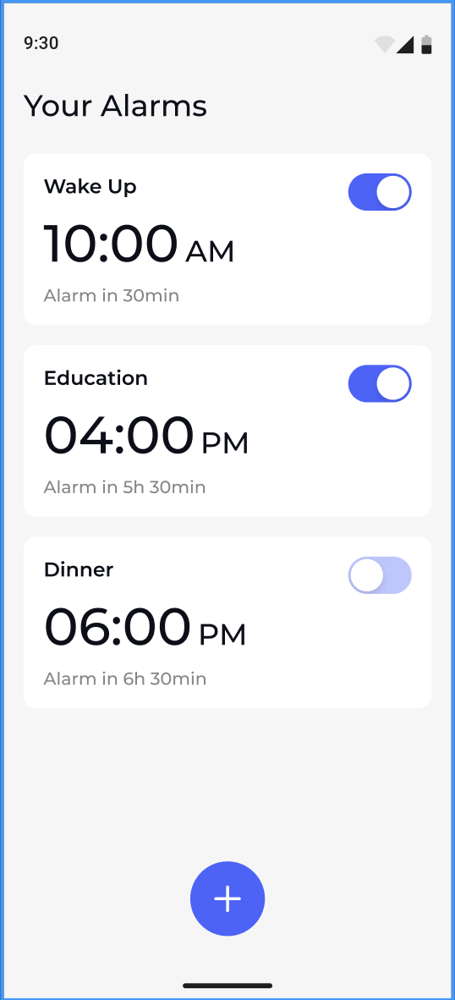
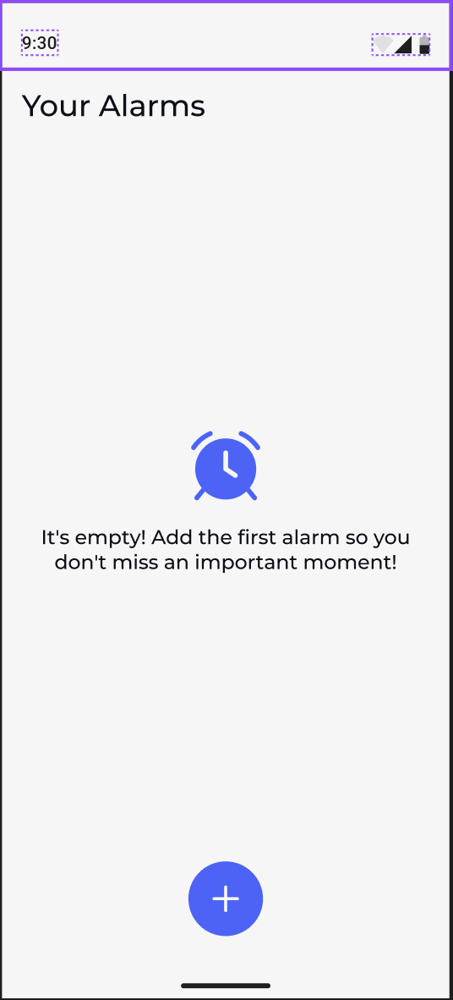
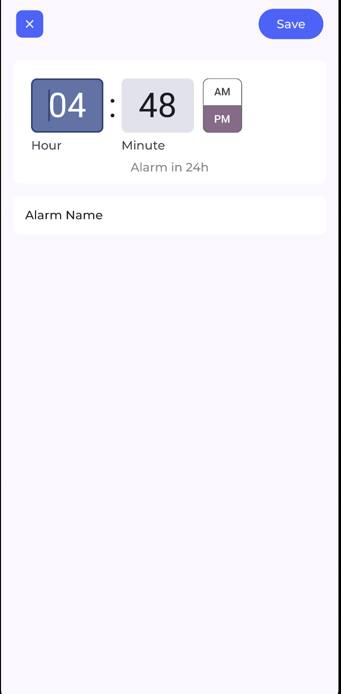
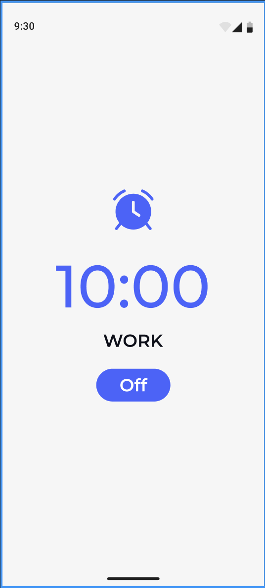

# Snoozeloo
## **About the App**
Snoozeloo is an intuitive and modern alarm application designed to simplify managing alarms. With an elegant user interface and robust functionality, Snoozeloo helps users manage their time efficiently.

## **Technologies Used**
- Jetpack Compose, Coroutines, Flow, Hilt, Jetpack Navigation, Android Alarm Manager, Broadcast Receiver, Full Screen Intent

## **Screenshots**
<table>
  <tr>
    <td style="text-align: center;">
       
      
<b>Alarm List Screen</b>

    </td>
    <td style="text-align: center;">
       
      
<b>Empty Alarms State</b>

    </td>
    <td style="text-align: center;">
       
      
<b>Alarm Settings Screen</b>

    </td>
    <td style="text-align: center;">
       
      
<b>Splash Screen</b>

    </td>
    <td style="text-align: center;">
       
      
<b>Trigger Alarm Screen</b>

    </td>
  </tr>
</table>

